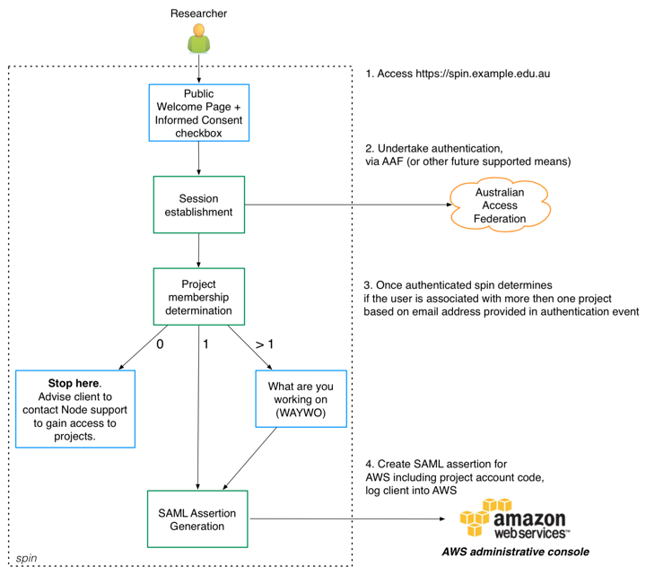
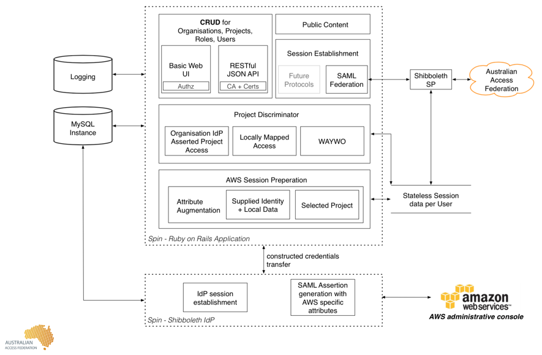

---
---

# SPIN

SPIN stands for SAML Provisioning for Independent Nodes. SPIN provides a means for subscribers of an Identity Federation to provide  [Amazon Web Services](http://aws.amazon.com/) access to their end-users.

Typical end-users of SPIN are researchers and research support staff that need to login to the AWS administrative console in order to control resources such as EC2 instances and S3 storage. SPIN may also be used to assist with limiting access to specific parts of the AWS administrative console by linking end-users federated credentials to AWS Identity and Access Management (IAM) roles. Finally SPIN assists with login when end-users are working on several projects concurrently and thus require access to several different AWS administrative consoles.

As with any federated service, the key feature of SPIN for end-users is usage of their well known institutional credentials to access AWS without the need to be issued new, less often used and thus easily forgotten credentials, for each AWS administrative console they require access to.

The general flow an end-user would expect to undertake when using SPIN to the AWS administrative console is outlined in figure 1 below:

Figure 1: End User Login Work Flow

Projects and roles can be managed with SPIN’s administration console and [RESTful API](http://ausaccessfed.github.io/spin/doc/api/v1/overview.html).

---

# Software Architecture

The technical components of SPIN are:

* A Ruby on Rails application
* A local MySQL database instance
* [Rapid Connect](https://rapid.aaf.edu.au/) for integrating to AAF subscribers
* A Shibboleth IdP for connection to AWS

Figure 2  outlines these components and their interaction.

Figure 2: Technical Components of SPIN

---

# What SPIN doesn’t do

SPIN **does not** relate to the management of AWS environments or billing. The SPIN system has been architected to operate independently of AWS.

SPIN supports federations which have deployed [Rapid Connect](https://rapid.aaf.edu.au/) — contact your local federation operator for support.

---

# Planning for your deployment of SPIN

The SPIN software is designed so you can deploy your own instance on a VM in your organisation. 

The recommended technical requirements for running a SPIN instance on a VM are as follows:

* Minimal CentOS 7 installation
* 2 CPU
* 4GB RAM
* 10GB+ partition for OS + SPIN
* Public IP address, with inbound access on ports 80, 443 and 8443
* Internet access (the installation process automatically fetches dependencies over HTTP / HTTPS)

SPIN features an automated installer. The following components will be installed and configured:

* Apache
* Ruby on Rails application
* MySQL instance
* Redis instance
* Shibboleth IdP for connecting to AWS
* Tomcat (for Shibboleth IdP)

Each SPIN installation can configure the following:

* A welcome page
* User consent
* Support details
* Project invitation emails
* Branding / name of application

After the installation has completed, the deployer must configure AWS Projects / Roles and their association with users.

---

# High Availability

You may operate SPIN in a highly available mode with 2 or more front end VM to run the Rails application and thus serve web content if required in your environment. A load balancer or similar may be used to achieve this. In this deployment model the MySQL database and Redis data store underpinning SPIN must also be highly available and shared for read/write across all VM.

The SPIN installer does not configure the Rails application, MySQL database and Redis data store in this way. Deployers wishing to operate in this manner should determine the most appropriate configuration for their current operating environment.

---

# Backup / Resilience

The SPIN installation provides **no backup or monitoring** of the platform. It is strongly suggested that deployers configure:

* Regular backups (VM, Database etc)

* Monitoring of service availability

* Monitoring of platform concerns, such as disk space and load average

---

# Detailed Installation Guide

When you’re comfortable with the overview, please continue with the [detailed guide](detailed_guide.html) to get started.

